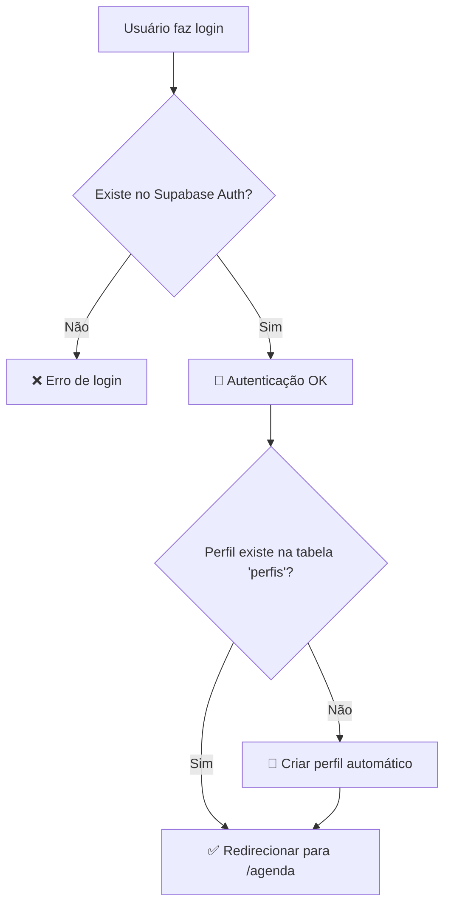

# 👥 Sistema de Usuários - Supabase vs Aplicação

## 🔐 **Como Funciona o Login**

### ✅ **SIM** - Usuários criados no painel do Supabase podem fazer login

Os usuários que você criar no **Supabase Dashboard** → **Authentication** → **Users** podem fazer login na aplicação.

### 🔄 **Fluxo Completo de Login:**



## 👥 **Duas Formas de Criar Usuários**

### **Método 1: Painel Supabase (Manual)**
1. **Dashboard Supabase** → **Authentication** → **Users**
2. **Add user** → Preencher email/senha
3. **Usuario será criado apenas no Auth** (sem perfil na aplicação)
4. **No primeiro login** → perfil será criado automaticamente

### **Método 2: Aplicação (Programático)**  
1. **Página Usuários** (apenas ADM)
2. **Criar novo usuário** → preenche nome, email, senha, tipo
3. **Cria no Auth E na tabela perfis** simultaneamente

## 🗃️ **Estrutura de Dados**

### **Supabase Auth (built-in)**
```sql
-- Tabela: auth.users (automática)
- id (UUID)
- email  
- encrypted_password
- email_confirmed_at
- created_at
```

### **Tabela Perfis (sua aplicação)**
```sql
-- Tabela: public.perfis (customizada)
- id (serial)
- user_id (UUID) → FK para auth.users.id
- nome (text)
- tipo_perfil ('ADM' ou 'Usuario')  
- created_at
```

## 🔧 **Como Testar**

### **1. Criar usuário no Painel Supabase:**
1. **Dashboard** → **Authentication** → **Users** → **Add user**
2. **Email:** `teste@exemplo.com`
3. **Password:** `123456789`
4. **Save**

### **2. Fazer login na aplicação:**
1. **Abrir sua app** → Página de Login
2. **Email:** `teste@exemplo.com` 
3. **Senha:** `123456789`
4. **Entrar**

### **3. Verificar resultado:**
- ✅ **Login bem-sucedido** → vai para `/agenda`
- ✅ **Perfil criado automaticamente** → tipo 'Usuario'
- ✅ **Aparece na lista de usuários** (se for ADM)

## ⚙️ **Configurações Importantes**

### **A. RLS (Row Level Security)**
```sql
-- Política para perfis: usuários só veem próprio perfil
CREATE POLICY "Usuários podem ver próprio perfil" ON perfis
  FOR SELECT USING (auth.uid() = user_id);
```

### **B. First Login Auto-Profile**
Código em `LoginPage.jsx`:
```javascript
// Se perfil não existe, cria automaticamente
const nomeInferido = user.email.split('@')[0];
await supabase.from('perfis').insert([{ 
  user_id: user.id, 
  nome: nomeInferido, 
  tipo_perfil: 'Usuario' 
}]);
```

## 🎯 **Cenários de Uso**

### **Usuário Admin (tipo: ADM)**
- ✅ Acessa página "Usuários" 
- ✅ Cria/edita/remove usuários
- ✅ Reseta senhas
- ✅ Vê badge "ADM" no header

### **Usuário Normal (tipo: Usuario)**  
- ✅ Faz login normalmente
- ✅ Acessa agenda, cadastros, relatórios
- ❌ NÃO acessa página "Usuários"
- ❌ Link "Usuários" não aparece no menu

## 🔐 **Primeiro Usuário Admin**

### **Problema:** Como criar o primeiro admin?

**Solução 1 - Via Painel:**
1. **Criar no Supabase Dashboard** → Authentication → Users
2. **Fazer login** → perfil será 'Usuario'
3. **Editar no banco:** `UPDATE perfis SET tipo_perfil = 'ADM' WHERE user_id = '...'`

**Solução 2 - Via SQL:**
```sql
-- Após primeiro login, promover para admin
UPDATE public.perfis 
SET tipo_perfil = 'ADM' 
WHERE user_id = (
  SELECT id FROM auth.users 
  WHERE email = 'admin@exemplo.com'
);
```

## ✅ **Resumo Final**

- ✅ **Usuários do painel Supabase** → fazem login na app
- ✅ **Primeiro login** → perfil criado automaticamente  
- ✅ **Perfil determina permissões** (ADM vs Usuario)
- ✅ **Página Usuários** → apenas para ADM
- ✅ **Dois métodos** → painel manual ou app programática

**Teste agora:** crie um usuário no painel Supabase e faça login! 🚀